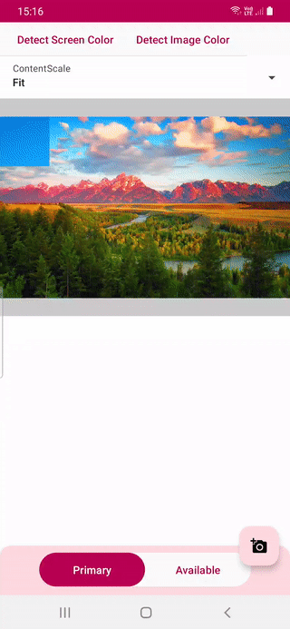

# Compose Color Detector

[](https://jitpack.io/#SmartToolFactory/Compose-Color-Detector)

Detect colors with name, hex code, RGB, HSL from image or your screen after taking it's screenshot
and color Palettes and profiles
using [Palette API](https://developer.android.com/training/material/palette-colors)
and [Compose ImageCropper library](https://github.com/SmartToolFactory/Compose-Image-Cropper)

<br>

| Screen | Image | 
| ----------|-----------| 
| |  |

## Gradle Setup

To get a Git project into your build:

* Step 1. Add the JitPack repository to your build file Add it in your root build.gradle at the end
  of repositories:

```
allprojects {
  repositories {
      ...
      maven { url 'https://jitpack.io' }
  }
}
```

* Step 2. Add the dependency

```
dependencies {
    implementation 'com.github.SmartToolFactory:Compose-Color-Detector:<version>'
}
```

## ScreenColorDetector

`ScreenColorDetector` uses `ImageWithThumbnail`
from [Compose Image library](https://github.com/SmartToolFactory/Compose-Image)
to display image in bounds and get bounds and show thumbnail on left or right side of the screenshot
when **enabled**

```kotlin
@Composable
fun ScreenColorDetector(
    modifier: Modifier = Modifier,
    enabled: Boolean = false,
    thumbnailSize: Dp = 80.dp,
    @IntRange(from = 100, to = 500) thumbnailZoom: Int = 200,
    screenRefreshPolicy: ScreenRefreshPolicy = OnEnable,
    content: @Composable () -> Unit,
    delayBeforeCapture: Long = 0L,
    onColorChange: (ColorData) -> Unit
) 
```

* **enabled** when enabled detect color at user's point of touch
* **thumbnailSize** size of the thumbnail that displays touch position with zoom
* **thumbnailZoom** zoom scale between 100% and 500%
* **screenRefreshPolicy** how to set or refresh screenshot of the screen. By default screenshot is
  taken when `enabled` flag is set to true after delay specified with `delayBeforeCapture`.
* If `OnDown` or `OnUp` is selected screenshot is taken when `enabled` is false and when first
  pointer is down or last pointer is up after delay specified with `delayBeforeCapture`
* **delayBeforeCapture** how many milliseconds should be waited before taking screenshot of the
  screen content is screen/Composable is displayed to user to get color from. `ScreenshotBox`
  gets `Bitmap` from screen when users first down and stores it.
* **onColorChange** callback to notify that user moved and picked a color

## ImageColorDetector

`ImageColorDetector` detects color and name from Image on user touch

```kotlin
@Composable
fun ImageColorDetector(
    modifier: Modifier = Modifier,
    imageBitmap: ImageBitmap,
    contentScale: ContentScale = ContentScale.FillBounds,
    alignment: Alignment = Alignment.Center,
    colorNameParser: ColorNameParser = rememberColorParser(),
    thumbnailSize: Dp = 70.dp,
    @IntRange(from = 100, to = 500) thumbnailZoom: Int = 200,
    onColorChange: (ColorData) -> Unit
)
```

* **imageBitmap** image is being drawn and colors to be detected
* **contentScale** how image should be layout inside the Canvas that is drawn
* **alignment** Optional alignment parameter used to place the ImageBitmap in the
* given bounds defined by the width and height
* **thumbnailSize** size of the thumbnail that displays touch position with zoom
* **thumbnailZoom** zoom scale between 100% and 500%
* **onColorChange** callback to notify that user moved and picked a color

## ImageColorPalette

```kotlin
@Composable
fun ImageColorPalette(
    modifier: Modifier = Modifier,
    imageBitmap: ImageBitmap,
    selectedIndex: Int,
    colorNameParser: ColorNameParser = rememberColorParser(),
    maximumColorCount: Int = 16,
    onColorChange: (ColorData) -> Unit
)
```

Generates color profiles and percentage of each color
using [Palette API](https://developer.android.com/training/material/palette-colors)
